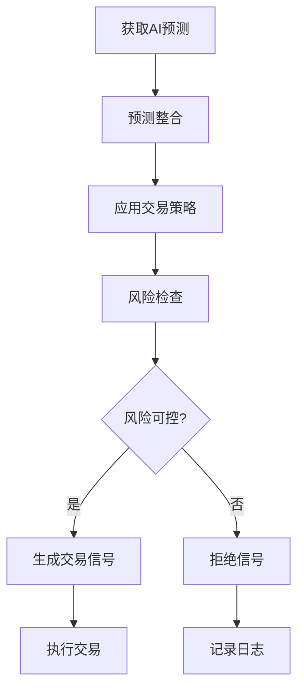

# 🎯 加密货币交易策略系统设计文档

## 📋 目录
1. [系统概述](#系统概述)
2. [多模型预测整合](#多模型预测整合)
3. [交易策略类型](#交易策略类型)
4. [风险管理系统](#风险管理系统)
5. [信号生成逻辑](#信号生成逻辑)
6. [实施方案](#实施方案)
7. [回测与优化](#回测与优化)

---

## 1. 系统概述 {#系统概述}

### 1.1 项目背景
本系统基于多AI模型（Grok, Gemini, DeepSeek）的价格预测结果，设计并实现自动化的加密货币交易策略。通过整合多个模型的预测意见，提高交易决策的准确性和稳定性。

### 1.2 系统目标
- **主要目标**: 将AI预测转化为可执行的交易信号
- **次要目标**: 
  - 实现风险可控的自动化交易
  - 提供多种策略选择适应不同市场环境
  - 建立完善的回测和优化框架

### 1.3 核心优势

- ✅ **多模型集成**: 降低单一模型误判风险
- ✅ **灵活策略**: 支持多种交易策略
- ✅ **风险管理**: 完善的止损止盈机制
- ✅ **可回测**: 历史数据验证策略有效性


---

## 2. 多模型预测整合 {#多模型预测整合}

### 2.1 预测数据结构
当前系统从三个AI模型获取预测数据：

```python
{
    "symbol": "BTCUSDT",
    "window_minutes": 5,
    "current_price": 50000.0,
    "timestamp": "2024-01-01 10:00:00",
    
    # Grok预测
    "grok_price": 50100.0,
    "grok_confidence": 75,
    "grok_direction": "up",
    
    # Gemini预测
    "gemini_price": 50150.0,
    "gemini_confidence": 80,
    "gemini_direction": "up",
    
    # DeepSeek预测
    "deepseek_price": 50050.0,
    "deepseek_confidence": 70,
    "deepseek_direction": "up"
}
```

### 2.2 模型权重分配

#### 2.2.1 静态权重法
根据历史表现为每个模型分配固定权重：

```python
MODEL_WEIGHTS = {
    "grok": 0.35,      # 35%权重
    "gemini": 0.35,    # 35%权重
    "deepseek": 0.30   # 30%权重
}
```

**加权平均价格计算**:
```python
weighted_price = (
    grok_price * 0.35 + 
    gemini_price * 0.35 + 
    deepseek_price * 0.30
)
```

#### 2.2.2 动态权重法（基于置信度）
根据每次预测的置信度动态调整权重：

```python
def calculate_dynamic_weights(predictions):
    """
    根据置信度动态计算权重
    
    Args:
        predictions: 包含各模型预测和置信度的字典
    
    Returns:
        归一化的权重字典
    """
    confidences = {
        "grok": predictions.get("grok_confidence", 0),
        "gemini": predictions.get("gemini_confidence", 0),
        "deepseek": predictions.get("deepseek_confidence", 0)
    }
    
    # 计算总置信度
    total_confidence = sum(confidences.values())
    
    if total_confidence == 0:
        return {"grok": 1/3, "gemini": 1/3, "deepseek": 1/3}
    
    # 归一化权重
    weights = {
        model: conf / total_confidence 
        for model, conf in confidences.items()
    }
    
    return weights
```

#### 2.2.3 自适应权重法
根据模型的历史准确率动态调整：

```python
class AdaptiveWeightCalculator:
    """自适应权重计算器"""
    
    def __init__(self):
        self.accuracy_history = {
            "grok": [],
            "gemini": [],
            "deepseek": []
        }
    
    def update_accuracy(self, model, was_correct):
        """
        更新模型准确率
        
        Args:
            model: 模型名称
            was_correct: 预测是否正确（布尔值）
        """
        self.accuracy_history[model].append(1 if was_correct else 0)
        
        # 只保留最近100次记录
        if len(self.accuracy_history[model]) > 100:
            self.accuracy_history[model].pop(0)
    
    def get_weights(self):
        """
        根据历史准确率计算权重
        
        Returns:
            权重字典
        """
        accuracies = {}
        
        for model, history in self.accuracy_history.items():
            if len(history) > 0:
                accuracies[model] = sum(history) / len(history)
            else:
                accuracies[model] = 0.33  # 默认权重
        
        # 归一化
        total = sum(accuracies.values())
        if total == 0:
            return {"grok": 1/3, "gemini": 1/3, "deepseek": 1/3}
        
        weights = {
            model: acc / total 
            for model, acc in accuracies.items()
        }
        
        return weights
```

### 2.3 预测整合方法

#### 方法1: 加权平均
```python
def weighted_average_prediction(predictions, weights):
    """
    加权平均预测价格
    
    Args:
        predictions: 预测数据字典
        weights: 权重字典
    
    Returns:
        加权平均价格和综合置信度
    """
    models = ["grok", "gemini", "deepseek"]
    
    weighted_price = 0
    weighted_confidence = 0
    
    for model in models:
        price = predictions.get(f"{model}_price")
        confidence = predictions.get(f"{model}_confidence", 0)
        weight = weights.get(model, 0)
        
        if price is not None:
            weighted_price += price * weight
            weighted_confidence += confidence * weight
    
    return weighted_price, weighted_confidence
```

#### 方法2: 投票机制
```python
def voting_prediction(predictions, threshold=0.6):
    """
    投票机制：多数模型同意才采纳
    
    Args:
        predictions: 预测数据字典
        threshold: 最低投票比例（默认60%）
    
    Returns:
        交易方向和置信度
    """
    directions = []
    confidences = []
    
    for model in ["grok", "gemini", "deepseek"]:
        direction = predictions.get(f"{model}_direction")
        confidence = predictions.get(f"{model}_confidence", 0)
        
        if direction:
            directions.append(direction)
            confidences.append(confidence)
    
    if not directions:
        return None, 0
    
    # 统计方向
    up_count = directions.count("up")
    down_count = directions.count("down")
    stable_count = directions.count("stable")
    
    total = len(directions)
    
    # 判断是否达到阈值
    if up_count / total >= threshold:
        return "up", sum(confidences) / len(confidences)
    elif down_count / total >= threshold:
        return "down", sum(confidences) / len(confidences)
    else:
        return "stable", sum(confidences) / len(confidences)
```

#### 方法3: 集成学习
```python
from sklearn.ensemble import RandomForestRegressor

class EnsemblePredictor:
    """集成学习预测器"""
    
    def __init__(self):
        self.model = RandomForestRegressor(n_estimators=100)
        self.trained = False
    
    def train(self, X_train, y_train):
        """
        训练集成模型
        
        Args:
            X_train: 特征矩阵 (各模型预测价格、置信度等)
            y_train: 真实价格
        """
        self.model.fit(X_train, y_train)
        self.trained = True
    
    def predict(self, predictions):
        """
        使用集成模型预测
        
        Args:
            predictions: 包含各模型预测的字典
        
        Returns:
            最终预测价格
        """
        if not self.trained:
            raise ValueError("模型未训练")
        
        # 构建特征向量
        features = [
            predictions.get("grok_price", 0),
            predictions.get("grok_confidence", 0),
            predictions.get("gemini_price", 0),
            predictions.get("gemini_confidence", 0),
            predictions.get("deepseek_price", 0),
            predictions.get("deepseek_confidence", 0)
        ]
        
        return self.model.predict([features])[0]
```

### 3.1 趋势跟踪策略

#### 3.1.1 策略描述
当多个模型一致预测价格上涨/下跌时，跟随趋势进行交易。

#### 3.1.2 入场条件
```python
def trend_following_entry(predictions, min_agreement=2):
    """
    趋势跟踪入场信号
    
    Args:
        predictions: 预测数据
        min_agreement: 最少需要几个模型同意（默认2个）
    
    Returns:
        交易信号: "BUY", "SELL", 或 None
    """
    directions = [
        predictions.get("grok_direction"),
        predictions.get("gemini_direction"),
        predictions.get("deepseek_direction")
    ]
    
    # 移除None值
    directions = [d for d in directions if d]
    
    if len(directions) < min_agreement:
        return None
    
    up_count = directions.count("up")
    down_count = directions.count("down")
    
    # 判断趋势
    if up_count >= min_agreement:
        return "BUY"
    elif down_count >= min_agreement:
        return "SELL"
    else:
        return None
```

#### 3.1.3 参数配置
```python
TREND_FOLLOWING_CONFIG = {
    "min_agreement": 2,           # 最少2个模型同意
    "min_confidence": 65,         # 最低置信度65%
    "stop_loss_percent": 0.02,    # 止损2%
    "take_profit_percent": 0.05,  # 止盈5%
    "position_size": 0.1          # 每次10%仓位
}
```

### 3.2 均值回归策略

#### 3.2.1 策略描述
当价格偏离预测均值较大时，预期价格会回归均值，进行反向交易。

#### 3.2.2 入场条件
```python
def mean_reversion_entry(current_price, predictions, deviation_threshold=0.015):
    """
    均值回归入场信号
    
    Args:
        current_price: 当前价格
        predictions: 预测数据
        deviation_threshold: 偏离阈值（默认1.5%）
    
    Returns:
        交易信号: "BUY", "SELL", 或 None
    """
    # 计算预测均价
    prices = [
        predictions.get("grok_price"),
        predictions.get("gemini_price"),
        predictions.get("deepseek_price")
    ]
    prices = [p for p in prices if p is not None]
    
    if not prices:
        return None
    
    mean_price = sum(prices) / len(prices)
    
    # 计算偏离度
    deviation = (current_price - mean_price) / mean_price
    
    # 价格高于均值较多，做空
    if deviation > deviation_threshold:
        return "SELL"
    # 价格低于均值较多，做多
    elif deviation < -deviation_threshold:
        return "BUY"
    else:
        return None
```

#### 3.2.3 参数配置
```python
MEAN_REVERSION_CONFIG = {
    "deviation_threshold": 0.015,  # 偏离1.5%触发
    "min_confidence": 60,          # 最低置信度60%
    "stop_loss_percent": 0.025,    # 止损2.5%
    "take_profit_percent": 0.015,  # 止盈1.5%（回归均值）
    "position_size": 0.15          # 每次15%仓位
}
```

### 3.3 突破策略

#### 3.3.1 策略描述
当预测价格突破关键价位（支撑/阻力）时，跟随突破方向交易。

#### 3.3.2 入场条件
```python
def breakout_entry(current_price, predictions, kline_data, breakout_threshold=0.02):
    """
    突破策略入场信号
    
    Args:
        current_price: 当前价格
        predictions: 预测数据
        kline_data: K线数据DataFrame
        breakout_threshold: 突破阈值（默认2%）
    
    Returns:
        交易信号: "BUY", "SELL", 或 None
    """
    # 计算最近的高低点
    recent_high = kline_data['high'].tail(20).max()
    recent_low = kline_data['low'].tail(20).min()
    
    # 计算预测均价
    prices = [
        predictions.get("grok_price"),
        predictions.get("gemini_price"),
        predictions.get("deepseek_price")
    ]
    prices = [p for p in prices if p is not None]
    
    if not prices:
        return None
    
    predicted_price = sum(prices) / len(prices)
    
    # 判断是否突破
    # 向上突破阻力位
    if predicted_price > recent_high * (1 + breakout_threshold):
        return "BUY"
    # 向下突破支撑位
    elif predicted_price < recent_low * (1 - breakout_threshold):
        return "SELL"
    else:
        return None
```

#### 3.3.3 参数配置
```python
BREAKOUT_CONFIG = {
    "breakout_threshold": 0.02,    # 突破2%才确认
    "min_confidence": 70,          # 最低置信度70%
    "lookback_period": 20,         # 回看20根K线
    "stop_loss_percent": 0.03,     # 止损3%
    "take_profit_percent": 0.08,   # 止盈8%
    "position_size": 0.12          # 每次12%仓位
}
```

### 3.4 网格交易策略

#### 3.4.1 策略描述
在预测价格区间内设置多个买卖网格，高抛低吸。

#### 3.4.2 网格设置
```python
class GridTradingStrategy:
    """网格交易策略"""
    
    def __init__(self, grid_count=10, grid_spacing=0.01):
        """
        初始化网格
        
        Args:
            grid_count: 网格数量
            grid_spacing: 网格间距（百分比）
        """
        self.grid_count = grid_count
        self.grid_spacing = grid_spacing
        self.grids = []
        self.positions = {}
    
    def setup_grids(self, current_price, predictions):
        """
        根据预测设置网格
        
        Args:
            current_price: 当前价格
            predictions: 预测数据
        """
        # 计算预测价格范围
        prices = [
            predictions.get("grok_price"),
            predictions.get("gemini_price"),
            predictions.get("deepseek_price")
        ]
        prices = [p for p in prices if p is not None]
        
        if not prices:
            return
        
        predicted_high = max(prices)
        predicted_low = min(prices)
        
        # 扩展范围（±5%）
        price_range_high = predicted_high * 1.05
        price_range_low = predicted_low * 0.95
        
        # 创建网格
        self.grids = []
        price_step = (price_range_high - price_range_low) / self.grid_count
        
        for i in range(self.grid_count + 1):
            grid_price = price_range_low + i * price_step
            self.grids.append({
                "price": grid_price,
                "type": "BUY" if grid_price < current_price else "SELL"
            })
    
    def check_grid_signals(self, current_price):
        """
        检查是否触发网格交易
        
        Args:
            current_price: 当前价格
        
        Returns:
            交易信号列表
        """
        signals = []
        
        for grid in self.grids:
            grid_price = grid["price"]
            grid_type = grid["type"]
            
            # 检查买入网格
            if grid_type == "BUY" and current_price <= grid_price:
                if grid_price not in self.positions:
                    signals.append({
                        "action": "BUY",
                        "price": grid_price,
                        "grid_id": grid_price
                    })
                    self.positions[grid_price] = "BOUGHT"
            
            # 检查卖出网格
            elif grid_type == "SELL" and current_price >= grid_price:
                # 找到对应的买入网格
                lower_grids = [g["price"] for g in self.grids 
                              if g["price"] < grid_price and 
                              g["price"] in self.positions]
                
                if lower_grids:
                    buy_price = max(lower_grids)
                    signals.append({
                        "action": "SELL",
                        "price": grid_price,
                        "buy_price": buy_price,
                        "profit": (grid_price - buy_price) / buy_price
                    })
                    del self.positions[buy_price]
        
        return signals
```

#### 3.4.3 参数配置
```python
GRID_TRADING_CONFIG = {
    "grid_count": 10,             # 10个网格
    "grid_spacing": 0.01,         # 1%间距
    "position_size_per_grid": 0.05,  # 每个网格5%仓位
    "min_profit": 0.005,          # 最低0.5%利润才卖出
    "max_grids_active": 5         # 最多同时5个网格活跃
}
```

### 3.5 马丁格尔策略（谨慎使用）

#### 3.5.1 策略描述
当交易亏损时，加倍下注以期待反转回本。**风险极高，仅供参考！**

#### 3.5.2 实现逻辑
```python
class MartingaleStrategy:
    """马丁格尔策略（高风险）"""
    
    def __init__(self, initial_size=0.01, multiplier=2.0, max_levels=5):
        """
        初始化马丁格尔策略
        
        Args:
            initial_size: 初始仓位大小
            multiplier: 倍数（默认2倍）
            max_levels: 最多加仓次数
        """
        self.initial_size = initial_size
        self.multiplier = multiplier
        self.max_levels = max_levels
        self.current_level = 0
        self.positions = []
    
    def should_add_position(self, predictions, current_loss_percent):
        """
        判断是否加仓
        
        Args:
            predictions: 预测数据
            current_loss_percent: 当前亏损百分比
        
        Returns:
            是否加仓和加仓大小
        """
        # 达到最大层数，停止加仓
        if self.current_level >= self.max_levels:
            return False, 0
        
        # 亏损超过2%且模型预测反转，加仓
        if current_loss_percent < -0.02:
            # 检查模型是否预测反转
            directions = [
                predictions.get("grok_direction"),
                predictions.get("gemini_direction"),
                predictions.get("deepseek_direction")
            ]
            
            # 简化：如果有任意模型预测反转
            if any(d in ["up", "stable"] for d in directions):
                self.current_level += 1
                new_size = self.initial_size * (self.multiplier ** self.current_level)
                return True, new_size
        
        return False, 0
    
    def reset(self):
        """重置策略状态"""
        self.current_level = 0
        self.positions = []
```

#### 3.5.3 风险警告
```python
MARTINGALE_WARNING = """
⚠️ 马丁格尔策略风险警告 ⚠️

1. 极高风险：可能导致账户爆仓
2. 不建议在真实交易中使用
3. 仅适用于模拟环境测试
4. 需要设置严格的止损
5. 资金管理至关重要

建议：使用其他更稳健的策略！
"""
```


---

## 4. 风险管理系统 {#风险管理系统}

### 4.1 仓位管理

#### 4.1.1 固定比例法
```python
def fixed_percentage_position(account_balance, risk_percent=0.02):
    """
    固定比例仓位计算
    
    Args:
        account_balance: 账户余额
        risk_percent: 风险比例（默认2%）
    
    Returns:
        建议仓位大小
    """
    return account_balance * risk_percent
```

#### 4.1.2 凯利公式法
```python
def kelly_criterion_position(win_rate, avg_win, avg_loss, account_balance):
    """
    凯利公式计算最优仓位
    
    Args:
        win_rate: 胜率（0-1）
        avg_win: 平均盈利比例
        avg_loss: 平均亏损比例
        account_balance: 账户余额
    
    Returns:
        建议仓位大小
    """
    if avg_loss == 0:
        return 0
    
    # 凯利公式: f = (p*b - q) / b
    # p=胜率, q=1-p, b=盈亏比
    win_loss_ratio = avg_win / avg_loss
    kelly_percent = (win_rate * win_loss_ratio - (1 - win_rate)) / win_loss_ratio
    
    # 限制最大仓位（凯利公式的一半，更保守）
    kelly_percent = max(0, min(kelly_percent * 0.5, 0.25))
    
    return account_balance * kelly_percent
```

#### 4.1.3 波动率调整法
```python
def volatility_adjusted_position(account_balance, current_volatility, 
                                 target_risk=0.02, baseline_volatility=0.02):
    """
    根据波动率调整仓位
    
    Args:
        account_balance: 账户余额
        current_volatility: 当前波动率
        target_risk: 目标风险
        baseline_volatility: 基准波动率
    
    Returns:
        调整后的仓位大小
    """
    if current_volatility == 0:
        return 0
    
    # 波动率越高，仓位越小
    adjustment_factor = baseline_volatility / current_volatility
    adjusted_risk = target_risk * adjustment_factor
    
    # 限制仓位范围
    adjusted_risk = max(0.005, min(adjusted_risk, 0.05))
    
    return account_balance * adjusted_risk
```

### 4.2 止损止盈设置

#### 4.2.1 固定百分比止损止盈
```python
class FixedStopLossTakeProfit:
    """固定百分比止损止盈"""
    
    def __init__(self, stop_loss_percent=0.02, take_profit_percent=0.05):
        """
        初始化
        
        Args:
            stop_loss_percent: 止损百分比
            take_profit_percent: 止盈百分比
        """
        self.stop_loss_percent = stop_loss_percent
        self.take_profit_percent = take_profit_percent
    
    def calculate_levels(self, entry_price, direction):
        """
        计算止损止盈价位
        
        Args:
            entry_price: 入场价格
            direction: 交易方向（"BUY" 或 "SELL"）
        
        Returns:
            (止损价, 止盈价)
        """
        if direction == "BUY":
            stop_loss = entry_price * (1 - self.stop_loss_percent)
            take_profit = entry_price * (1 + self.take_profit_percent)
        else:  # SELL
            stop_loss = entry_price * (1 + self.stop_loss_percent)
            take_profit = entry_price * (1 - self.take_profit_percent)
        
        return stop_loss, take_profit
```

#### 4.2.2 ATR动态止损
```python
def calculate_atr(kline_data, period=14):
    """
    计算平均真实波动幅度（ATR）
    
    Args:
        kline_data: K线数据DataFrame
        period: 周期（默认14）
    
    Returns:
        ATR值
    """
    high = kline_data['high']
    low = kline_data['low']
    close = kline_data['close']
    
    # 计算真实波动幅度
    tr1 = high - low
    tr2 = abs(high - close.shift())
    tr3 = abs(low - close.shift())
    
    tr = pd.concat([tr1, tr2, tr3], axis=1).max(axis=1)
    
    # 计算ATR
    atr = tr.rolling(window=period).mean()
    
    return atr.iloc[-1]

class ATRStopLoss:
    """基于ATR的动态止损"""
    
    def __init__(self, atr_multiplier=2.0):
        """
        初始化
        
        Args:
            atr_multiplier: ATR倍数（默认2倍）
        """
        self.atr_multiplier = atr_multiplier
    
    def calculate_stop_loss(self, entry_price, direction, kline_data):
        """
        计算止损价位
        
        Args:
            entry_price: 入场价格
            direction: 交易方向
            kline_data: K线数据
        
        Returns:
            止损价格
        """
        atr = calculate_atr(kline_data)
        stop_distance = atr * self.atr_multiplier
        
        if direction == "BUY":
            return entry_price - stop_distance
        else:  # SELL
            return entry_price + stop_distance
```

#### 4.2.3 移动止损（Trailing Stop）
```python
class TrailingStop:
    """移动止损"""
    
    def __init__(self, trailing_percent=0.02):
        """
        初始化
        
        Args:
            trailing_percent: 移动止损百分比
        """
        self.trailing_percent = trailing_percent
        self.highest_price = None
        self.lowest_price = None
    
    def update(self, current_price, direction):
        """
        更新止损价位
        
        Args:
            current_price: 当前价格
            direction: 交易方向
        
        Returns:
            当前止损价格
        """
        if direction == "BUY":
            # 做多：跟踪最高价
            if self.highest_price is None or current_price > self.highest_price:
                self.highest_price = current_price
            
            stop_loss = self.highest_price * (1 - self.trailing_percent)
            return stop_loss
        
        else:  # SELL
            # 做空：跟踪最低价
            if self.lowest_price is None or current_price < self.lowest_price:
                self.lowest_price = current_price
            
            stop_loss = self.lowest_price * (1 + self.trailing_percent)
            return stop_loss
    
    def reset(self):
        """重置止损状态"""
        self.highest_price = None
        self.lowest_price = None
```

### 4.3 最大回撤控制

#### 4.3.1 账户级别回撤限制
```python
class DrawdownController:
    """回撤控制器"""
    
    def __init__(self, max_drawdown_percent=0.10):
        """
        初始化
        
        Args:
            max_drawdown_percent: 最大回撤百分比（默认10%）
        """
        self.max_drawdown_percent = max_drawdown_percent
        self.peak_balance = 0
        self.trading_enabled = True
    
    def update(self, current_balance):
        """
        更新回撤状态
        
        Args:
            current_balance: 当前账户余额
        
        Returns:
            是否允许继续交易
        """
        # 更新峰值
        if current_balance > self.peak_balance:
            self.peak_balance = current_balance
        
        # 计算当前回撤
        if self.peak_balance > 0:
            current_drawdown = (self.peak_balance - current_balance) / self.peak_balance
            
            # 超过最大回撤，暂停交易
            if current_drawdown > self.max_drawdown_percent:
                self.trading_enabled = False
                return False
            else:
                self.trading_enabled = True
                return True
        
        return True
    
    def get_current_drawdown(self, current_balance):
        """获取当前回撤百分比"""
        if self.peak_balance == 0:
            return 0
        return (self.peak_balance - current_balance) / self.peak_balance
```

#### 4.3.2 单笔交易风险限制
```python
def check_single_trade_risk(position_size, account_balance, 
                            stop_loss_percent, max_risk_percent=0.02):
    """
    检查单笔交易风险是否过大
    
    Args:
        position_size: 仓位大小
        account_balance: 账户余额
        stop_loss_percent: 止损百分比
        max_risk_percent: 最大风险百分比（默认2%）
    
    Returns:
        是否通过风险检查
    """
    # 计算潜在亏损
    potential_loss = position_size * stop_loss_percent
    risk_percent = potential_loss / account_balance
    
    return risk_percent <= max_risk_percent
```

### 4.4 多元化分散

#### 4.4.1 多币种分散
```python
class PortfolioDiversification:
    """投资组合多元化"""
    
    def __init__(self, max_positions=5, max_per_symbol=0.30):
        """
        初始化
        
        Args:
            max_positions: 最大持仓数量
            max_per_symbol: 单一币种最大占比
        """
        self.max_positions = max_positions
        self.max_per_symbol = max_per_symbol
        self.positions = {}
    
    def can_open_position(self, symbol, position_size, total_portfolio_value):
        """
        检查是否可以开仓
        
        Args:
            symbol: 交易对
            position_size: 仓位大小
            total_portfolio_value: 总资产价值
        
        Returns:
            是否允许开仓
        """
        # 检查持仓数量
        if len(self.positions) >= self.max_positions and symbol not in self.positions:
            return False
        
        # 检查单一币种占比
        current_size = self.positions.get(symbol, 0)
        new_total_size = current_size + position_size
        
        if new_total_size / total_portfolio_value > self.max_per_symbol:
            return False
        
        return True
    
    def update_position(self, symbol, size):
        """更新持仓"""
        self.positions[symbol] = size
        
        if size == 0:
            del self.positions[symbol]
```

#### 4.4.2 时间分散（定投）
```python
class TimeBasedDiversification:
    """时间分散策略（定投）"""
    
    def __init__(self, total_amount, periods=10):
        """
        初始化
        
        Args:
            total_amount: 总投资金额
            periods: 分散周期数
        """
        self.total_amount = total_amount
        self.periods = periods
        self.amount_per_period = total_amount / periods
        self.periods_invested = 0
    
    def get_next_investment(self):
        """
        获取下一期投资金额
        
        Returns:
            投资金额，如果已完成则返回None
        """
        if self.periods_invested >= self.periods:
            return None
        
        self.periods_invested += 1
        return self.amount_per_period
```

### 4.5 风险监控与报警

#### 4.5.1 实时风险监控
```python
class RiskMonitor:
    """风险监控系统"""
    
    def __init__(self):
        self.alerts = []
        self.risk_metrics = {}
    
    def check_risks(self, account_balance, positions, drawdown_percent):
        """
        检查各项风险指标
        
        Args:
            account_balance: 账户余额
            positions: 持仓列表
            drawdown_percent: 回撤百分比
        
        Returns:
            风险报警列表
        """
        alerts = []
        
        # 1. 检查回撤
        if drawdown_percent > 0.08:
            alerts.append({
                "level": "WARNING",
                "message": f"回撤达到 {drawdown_percent*100:.1f}%，接近止损线"
            })
        
        if drawdown_percent > 0.10:
            alerts.append({
                "level": "CRITICAL",
                "message": f"回撤超过 {drawdown_percent*100:.1f}%，建议暂停交易"
            })
        
        # 2. 检查持仓集中度
        if len(positions) > 0:
            total_exposure = sum(p['size'] for p in positions)
            exposure_ratio = total_exposure / account_balance
            
            if exposure_ratio > 0.80:
                alerts.append({
                    "level": "WARNING",
                    "message": f"持仓占比 {exposure_ratio*100:.1f}%，过于激进"
                })
        
        # 3. 检查连续亏损
        recent_trades = self.get_recent_trades(10)
        if len(recent_trades) >= 5:
            losing_streak = 0
            for trade in recent_trades:
                if trade['profit'] < 0:
                    losing_streak += 1
                else:
                    break
            
            if losing_streak >= 5:
                alerts.append({
                    "level": "WARNING",
                    "message": f"连续 {losing_streak} 笔亏损，建议检查策略"
                })
        
        self.alerts = alerts
        return alerts
    
    def get_recent_trades(self, count):
        """获取最近的交易记录（示例方法）"""
        # 这里需要从交易历史数据库获取
        return []
```


---

## 5. 信号生成逻辑 {#信号生成逻辑}

### 5.1 信号生成流程



### 5.2 信号生成器实现

```python
class SignalGenerator:
    """交易信号生成器"""
    
    def __init__(self, strategy_type="trend_following", risk_config=None):
        """
        初始化信号生成器
        
        Args:
            strategy_type: 策略类型
            risk_config: 风险配置
        """
        self.strategy_type = strategy_type
        self.risk_config = risk_config or self._default_risk_config()
        self.risk_monitor = RiskMonitor()
        self.position_manager = PositionManager()
    
    def _default_risk_config(self):
        """默认风险配置"""
        return {
            "max_position_size": 0.10,
            "stop_loss_percent": 0.02,
            "take_profit_percent": 0.05,
            "max_drawdown": 0.10,
            "min_confidence": 65
        }
    
    def generate_signal(self, predictions, current_price, kline_data, account_info):
        """
        生成交易信号
        
        Args:
            predictions: AI预测数据
            current_price: 当前价格
            kline_data: K线数据
            account_info: 账户信息
        
        Returns:
            交易信号字典或None
        """
        # 步骤1: 预测整合
        integrated_prediction = self._integrate_predictions(predictions)
        
        if not integrated_prediction:
            return None
        
        # 步骤2: 策略判断
        strategy_signal = self._apply_strategy(
            integrated_prediction,
            current_price,
            kline_data
        )
        
        if not strategy_signal:
            return None
        
        # 步骤3: 风险检查
        risk_approved = self._check_risk(
            strategy_signal,
            account_info,
            predictions
        )
        
        if not risk_approved:
            logger.warning(f"信号未通过风险检查: {strategy_signal}")
            return None
        
        # 步骤4: 生成完整信号
        signal = self._build_signal(
            strategy_signal,
            integrated_prediction,
            current_price,
            account_info
        )
        
        return signal
    
    def _integrate_predictions(self, predictions):
        """整合AI预测"""
        # 检查是否有有效预测
        valid_predictions = 0
        total_confidence = 0
        directions = []
        prices = []
        
        for model in ["grok", "gemini", "deepseek"]:
            price = predictions.get(f"{model}_price")
            confidence = predictions.get(f"{model}_confidence")
            direction = predictions.get(f"{model}_direction")
            
            if price and confidence:
                valid_predictions += 1
                total_confidence += confidence
                directions.append(direction)
                prices.append(price)
        
        if valid_predictions == 0:
            return None
        
        # 计算平均值
        avg_price = sum(prices) / len(prices)
        avg_confidence = total_confidence / valid_predictions
        
        # 判断方向一致性
        up_count = directions.count("up")
        down_count = directions.count("down")
        
        if up_count > down_count:
            consensus_direction = "up"
            agreement_ratio = up_count / len(directions)
        elif down_count > up_count:
            consensus_direction = "down"
            agreement_ratio = down_count / len(directions)
        else:
            consensus_direction = "neutral"
            agreement_ratio = 0.5
        
        return {
            "predicted_price": avg_price,
            "confidence": avg_confidence,
            "direction": consensus_direction,
            "agreement_ratio": agreement_ratio,
            "valid_models": valid_predictions
        }
    
    def _apply_strategy(self, integrated_prediction, current_price, kline_data):
        """应用交易策略"""
        if self.strategy_type == "trend_following":
            return self._trend_following_strategy(
                integrated_prediction,
                current_price
            )
        elif self.strategy_type == "mean_reversion":
            return self._mean_reversion_strategy(
                integrated_prediction,
                current_price
            )
        elif self.strategy_type == "breakout":
            return self._breakout_strategy(
                integrated_prediction,
                current_price,
                kline_data
            )
        else:
            return None
    
    def _trend_following_strategy(self, prediction, current_price):
        """趋势跟踪策略"""
        # 需要至少2个模型同意
        if prediction["agreement_ratio"] < 0.67:
            return None
        
        # 置信度检查
        if prediction["confidence"] < self.risk_config["min_confidence"]:
            return None
        
        # 生成信号
        if prediction["direction"] == "up":
            return {
                "action": "BUY",
                "reason": "趋势向上",
                "confidence": prediction["confidence"]
            }
        elif prediction["direction"] == "down":
            return {
                "action": "SELL",
                "reason": "趋势向下",
                "confidence": prediction["confidence"]
            }
        
        return None
    
    def _mean_reversion_strategy(self, prediction, current_price):
        """均值回归策略"""
        predicted_price = prediction["predicted_price"]
        deviation = (current_price - predicted_price) / predicted_price
        
        # 偏离阈值1.5%
        if abs(deviation) < 0.015:
            return None
        
        # 价格高于预测，做空
        if deviation > 0.015:
            return {
                "action": "SELL",
                "reason": "价格高于预测，预期回归",
                "confidence": prediction["confidence"]
            }
        # 价格低于预测，做多
        elif deviation < -0.015:
            return {
                "action": "BUY",
                "reason": "价格低于预测，预期回归",
                "confidence": prediction["confidence"]
            }
        
        return None
    
    def _breakout_strategy(self, prediction, current_price, kline_data):
        """突破策略"""
        # 计算支撑阻力
        recent_high = kline_data['high'].tail(20).max()
        recent_low = kline_data['low'].tail(20).min()
        
        predicted_price = prediction["predicted_price"]
        
        # 向上突破
        if predicted_price > recent_high * 1.02:
            return {
                "action": "BUY",
                "reason": f"突破阻力位 ${recent_high:.2f}",
                "confidence": prediction["confidence"]
            }
        # 向下突破
        elif predicted_price < recent_low * 0.98:
            return {
                "action": "SELL",
                "reason": f"跌破支撑位 ${recent_low:.2f}",
                "confidence": prediction["confidence"]
            }
        
        return None
    
    def _check_risk(self, signal, account_info, predictions):
        """风险检查"""
        # 1. 检查账户回撤
        if account_info["drawdown_percent"] > self.risk_config["max_drawdown"]:
            logger.warning("账户回撤过大，拒绝信号")
            return False
        
        # 2. 检查持仓数量
        if len(account_info["positions"]) >= 5:
            logger.warning("持仓数量已达上限")
            return False
        
        # 3. 检查单笔风险
        position_size = account_info["balance"] * self.risk_config["max_position_size"]
        potential_loss = position_size * self.risk_config["stop_loss_percent"]
        risk_ratio = potential_loss / account_info["balance"]
        
        if risk_ratio > 0.02:
            logger.warning(f"单笔风险过高: {risk_ratio*100:.2f}%")
            return False
        
        return True
    
    def _build_signal(self, strategy_signal, prediction, current_price, account_info):
        """构建完整信号"""
        action = strategy_signal["action"]
        
        # 计算仓位大小
        position_size = account_info["balance"] * self.risk_config["max_position_size"]
        
        # 计算止损止盈
        if action == "BUY":
            stop_loss = current_price * (1 - self.risk_config["stop_loss_percent"])
            take_profit = current_price * (1 + self.risk_config["take_profit_percent"])
        else:  # SELL
            stop_loss = current_price * (1 + self.risk_config["stop_loss_percent"])
            take_profit = current_price * (1 - self.risk_config["take_profit_percent"])
        
        signal = {
            "timestamp": datetime.now().strftime("%Y-%m-%d %H:%M:%S"),
            "action": action,
            "symbol": prediction.get("symbol", "UNKNOWN"),
            "entry_price": current_price,
            "position_size": position_size,
            "stop_loss": stop_loss,
            "take_profit": take_profit,
            "confidence": prediction["confidence"],
            "reason": strategy_signal["reason"],
            "strategy": self.strategy_type,
            "predicted_price": prediction["predicted_price"],
            "agreement_ratio": prediction["agreement_ratio"]
        }
        
        return signal
```

### 5.3 信号过滤器

```python
class SignalFilter:
    """信号过滤器 - 过滤低质量信号"""
    
    def __init__(self):
        self.filters = [
            self._confidence_filter,
            self._agreement_filter,
            self._volatility_filter,
            self._time_filter
        ]
    
    def filter_signal(self, signal, kline_data):
        """
        过滤信号
        
        Args:
            signal: 交易信号
            kline_data: K线数据
        
        Returns:
            是否通过过滤
        """
        for filter_func in self.filters:
            if not filter_func(signal, kline_data):
                return False
        
        return True
    
    def _confidence_filter(self, signal, kline_data):
        """置信度过滤"""
        min_confidence = 60
        
        if signal["confidence"] < min_confidence:
            logger.info(f"置信度过低: {signal['confidence']}%")
            return False
        
        return True
    
    def _agreement_filter(self, signal, kline_data):
        """一致性过滤"""
        min_agreement = 0.6  # 至少60%模型同意
        
        if signal.get("agreement_ratio", 0) < min_agreement:
            logger.info(f"模型一致性不足: {signal.get('agreement_ratio', 0)*100:.1f}%")
            return False
        
        return True
    
    def _volatility_filter(self, signal, kline_data):
        """波动率过滤 - 波动过大时避免交易"""
        atr = calculate_atr(kline_data)
        current_price = kline_data['close'].iloc[-1]
        
        volatility_ratio = atr / current_price
        
        # 波动率超过3%，认为市场过于波动
        if volatility_ratio > 0.03:
            logger.info(f"市场波动过大: {volatility_ratio*100:.2f}%")
            return False
        
        return True
    
    def _time_filter(self, signal, kline_data):
        """时间过滤 - 避免在特定时间交易"""
        current_hour = datetime.now().hour
        
        # 避免在凌晨2-6点交易（流动性低）
        if 2 <= current_hour < 6:
            logger.info(f"当前时间不适合交易: {current_hour}点")
            return False
        
        return True
```

### 5.4 信号优先级排序

```python
class SignalPrioritizer:
    """信号优先级排序"""
    
    def rank_signals(self, signals):
        """
        对多个信号进行排序
        
        Args:
            signals: 信号列表
        
        Returns:
            排序后的信号列表
        """
        # 计算每个信号的分数
        scored_signals = []
        
        for signal in signals:
            score = self._calculate_score(signal)
            scored_signals.append({
                "signal": signal,
                "score": score
            })
        
        # 按分数降序排序
        scored_signals.sort(key=lambda x: x["score"], reverse=True)
        
        return [s["signal"] for s in scored_signals]
    
    def _calculate_score(self, signal):
        """
        计算信号分数
        
        Args:
            signal: 交易信号
        
        Returns:
            分数（0-100）
        """
        score = 0
        
        # 1. 置信度权重（40分）
        score += signal["confidence"] * 0.4
        
        # 2. 一致性权重（30分）
        score += signal.get("agreement_ratio", 0) * 30
        
        # 3. 风险收益比权重（30分）
        entry_price = signal["entry_price"]
        stop_loss = signal["stop_loss"]
        take_profit = signal["take_profit"]
        
        risk = abs(entry_price - stop_loss)
        reward = abs(take_profit - entry_price)
        
        if risk > 0:
            risk_reward_ratio = reward / risk
            # 风险收益比越大越好，最高30分
            score += min(risk_reward_ratio * 10, 30)
        
        return score
```

### 5.5 信号执行管理

```python
class SignalExecutor:
    """信号执行器"""
    
    def __init__(self, exchange_api):
        """
        初始化
        
        Args:
            exchange_api: 交易所API接口
        """
        self.exchange_api = exchange_api
        self.pending_orders = []
        self.executed_orders = []
    
    def execute_signal(self, signal):
        """
        执行交易信号
        
        Args:
            signal: 交易信号
        
        Returns:
            执行结果
        """
        try:
            # 1. 下单
            order = self._place_order(signal)
            
            if not order:
                return {"success": False, "message": "下单失败"}
            
            # 2. 设置止损止盈
            self._set_stop_loss_take_profit(order, signal)
            
            # 3. 记录
            self.executed_orders.append({
                "signal": signal,
                "order": order,
                "timestamp": datetime.now()
            })
            
            logger.info(f"信号执行成功: {signal['action']} {signal['symbol']} @ {signal['entry_price']}")
            
            return {
                "success": True,
                "order_id": order["id"],
                "message": "订单已提交"
            }
            
        except Exception as e:
            logger.error(f"信号执行失败: {e}")
            return {
                "success": False,
                "message": str(e)
            }
    
    def _place_order(self, signal):
        """下单（示例实现）"""
        # 实际需要调用交易所API
        # 这里仅为示例
        order = {
            "id": f"ORDER_{int(time.time())}",
            "symbol": signal["symbol"],
            "side": signal["action"].lower(),
            "price": signal["entry_price"],
            "amount": signal["position_size"],
            "status": "filled"
        }
        
        return order
    
    def _set_stop_loss_take_profit(self, order, signal):
        """设置止损止盈（示例实现）"""
        # 实际需要调用交易所API设置止损止盈订单
        pass
```


---

## 6. 实施方案 {#实施方案}

### 6.1 系统架构

```
┌─────────────────────────────────────────────────────────────┐
│                    交易策略系统架构                           │
└─────────────────────────────────────────────────────────────┘

┌──────────────┐      ┌──────────────┐      ┌──────────────┐
│ 数据获取层    │      │ AI预测层     │      │ 策略决策层    │
│              │      │              │      │              │
│ - Binance    │─────>│ - Grok       │─────>│ - 趋势跟踪   │
│ - K线数据    │      │ - Gemini     │      │ - 均值回归   │
│ - 市场数据   │      │ - DeepSeek   │      │ - 突破策略   │
└──────────────┘      └──────────────┘      └──────┬───────┘
                                                     │
                                                     v
┌──────────────┐      ┌──────────────┐      ┌──────────────┐
│ 风险管理层    │<─────│ 信号生成层    │<─────│ 信号过滤层    │
│              │      │              │      │              │
│ - 仓位管理   │      │ - 整合预测   │      │ - 置信度     │
│ - 止损止盈   │      │ - 应用策略   │      │ - 一致性     │
│ - 回撤控制   │      │ - 风险检查   │      │ - 波动率     │
└──────┬───────┘      └──────────────┘      └──────────────┘
       │
       v
┌──────────────┐      ┌──────────────┐      ┌──────────────┐
│ 执行层        │      │ 监控层       │      │ 数据存储层    │
│              │      │              │      │              │
│ - 下单       │      │ - 实时监控   │      │ - PostgreSQL │
│ - 撤单       │      │ - 报警系统   │      │ - Redis      │
│ - 修改订单   │      │ - 日志记录   │      │ - CSV导出    │
└──────────────┘      └──────────────┘      └──────────────┘
```

### 6.2 技术栈选择

#### 6.2.1 编程语言与框架
```python
TECH_STACK = {
    "语言": "Python 3.8+",
    "数据处理": ["pandas", "numpy"],
    "机器学习": ["scikit-learn", "tensorflow (可选)"],
    "API调用": ["requests", "ccxt (交易所)"],
    "数据库": ["PostgreSQL", "Redis"],
    "任务调度": ["APScheduler", "Celery"],
    "Web框架": ["FastAPI", "Streamlit (可视化)"],
    "日志": ["logging", "loguru"],
    "测试": ["pytest", "unittest"]
}
```

#### 6.2.2 目录结构
```
crypto_trading_system/
├── config/
│   ├── __init__.py
│   ├── settings.py              # 系统配置
│   ├── strategies.py            # 策略配置
│   └── risk_params.py           # 风险参数
│
├── data/
│   ├── __init__.py
│   ├── fetcher.py               # 数据获取（已有）
│   ├── processor.py             # 数据处理
│   └── storage.py               # 数据存储
│
├── models/
│   ├── __init__.py
│   ├── ai_predictor.py          # AI预测（已有）
│   ├── ensemble.py              # 集成学习
│   └── evaluator.py             # 模型评估
│
├── strategies/
│   ├── __init__.py
│   ├── base.py                  # 策略基类
│   ├── trend_following.py       # 趋势跟踪
│   ├── mean_reversion.py        # 均值回归
│   ├── breakout.py              # 突破策略
│   └── grid.py                  # 网格交易
│
├── risk/
│   ├── __init__.py
│   ├── position_manager.py      # 仓位管理
│   ├── stop_loss.py             # 止损管理
│   ├── drawdown_controller.py   # 回撤控制
│   └── risk_monitor.py          # 风险监控
│
├── signals/
│   ├── __init__.py
│   ├── generator.py             # 信号生成
│   ├── filter.py                # 信号过滤
│   ├── prioritizer.py           # 信号排序
│   └── executor.py              # 信号执行
│
├── exchange/
│   ├── __init__.py
│   ├── binance_api.py           # Binance API
│   ├── order_manager.py         # 订单管理
│   └── account_manager.py       # 账户管理
│
├── backtest/
│   ├── __init__.py
│   ├── engine.py                # 回测引擎
│   ├── metrics.py               # 性能指标
│   └── visualizer.py            # 结果可视化
│
├── monitor/
│   ├── __init__.py
│   ├── dashboard.py             # 监控面板
│   ├── alerts.py                # 报警系统
│   └── logger.py                # 日志管理
│
├── utils/
│   ├── __init__.py
│   ├── helpers.py               # 辅助函数
│   ├── validators.py            # 数据验证
│   └── constants.py             # 常量定义
│
├── tests/
│   ├── test_strategies.py
│   ├── test_signals.py
│   ├── test_risk.py
│   └── test_integration.py
│
├── main.py                      # 主程序（已有）
├── trading_bot.py               # 交易机器人
├── backtest_runner.py           # 回测运行器
├── requirements.txt             # 依赖（已有）
└── README.md                    # 文档（已有）
```

### 6.3 核心模块实现

#### 6.3.1 交易机器人主程序
```python
# trading_bot.py
import time
import logging
from datetime import datetime
from signals.generator import SignalGenerator
from signals.executor import SignalExecutor
from risk.risk_monitor import RiskMonitor
from exchange.binance_api import BinanceAPI
from data.fetcher import BinanceDataFetcher
from models.ai_predictor import MultiModelPredictor
import config

logger = logging.getLogger(__name__)

class TradingBot:
    """自动交易机器人"""
    
    def __init__(self, strategy_type="trend_following", mode="simulation"):
        """
        初始化交易机器人
        
        Args:
            strategy_type: 策略类型
            mode: 运行模式（simulation/live）
        """
        self.strategy_type = strategy_type
        self.mode = mode
        self.running = False
        
        # 初始化组件
        logger.info("初始化交易机器人...")
        
        self.data_fetcher = BinanceDataFetcher()
        self.ai_predictor = MultiModelPredictor(config.API_KEYS)
        self.signal_generator = SignalGenerator(strategy_type)
        self.risk_monitor = RiskMonitor()
        
        if mode == "live":
            self.exchange_api = BinanceAPI(
                api_key=config.BINANCE_API_KEY,
                api_secret=config.BINANCE_API_SECRET
            )
            self.signal_executor = SignalExecutor(self.exchange_api)
        else:
            self.signal_executor = None
        
        logger.info(f"交易机器人初始化完成 - 模式: {mode}, 策略: {strategy_type}")
    
    def start(self):
        """启动机器人"""
        self.running = True
        logger.info("="*80)
        logger.info("交易机器人启动")
        logger.info("="*80)
        
        try:
            while self.running:
                self._trading_cycle()
                time.sleep(config.TRADING_INTERVAL)
        
        except KeyboardInterrupt:
            logger.info("收到停止信号")
            self.stop()
        except Exception as e:
            logger.error(f"机器人运行错误: {e}", exc_info=True)
            self.stop()
    
    def stop(self):
        """停止机器人"""
        self.running = False
        logger.info("交易机器人已停止")
    
    def _trading_cycle(self):
        """单次交易循环"""
        try:
            logger.info(f"\n{'='*80}")
            logger.info(f"交易循环开始 - {datetime.now()}")
            logger.info(f"{'='*80}")
            
            # 1. 获取数据
            market_data = self._fetch_market_data()
            
            if not market_data:
                logger.warning("无法获取市场数据，跳过本轮")
                return
            
            # 2. 生成预测
            predictions = self._generate_predictions(market_data)
            
            if not predictions:
                logger.warning("无法生成预测，跳过本轮")
                return
            
            # 3. 获取账户信息
            account_info = self._get_account_info()
            
            # 4. 生成信号
            signals = self._generate_signals(predictions, market_data, account_info)
            
            if not signals:
                logger.info("本轮无交易信号")
                return
            
            # 5. 执行信号
            if self.mode == "live" and self.signal_executor:
                for signal in signals:
                    result = self.signal_executor.execute_signal(signal)
                    logger.info(f"信号执行结果: {result}")
            else:
                logger.info(f"模拟模式 - 生成 {len(signals)} 个信号:")
                for signal in signals:
                    logger.info(f"  {signal['action']} {signal['symbol']} @ {signal['entry_price']}")
            
            # 6. 风险监控
            self._monitor_risks(account_info)
            
        except Exception as e:
            logger.error(f"交易循环错误: {e}", exc_info=True)
    
    def _fetch_market_data(self):
        """获取市场数据"""
        market_data = {}
        
        for symbol in config.SYMBOLS:
            # 获取K线数据
            klines = self.data_fetcher.fetch_recent_klines(symbol, minutes=15)
            
            if klines is not None:
                market_data[symbol] = {
                    "klines": klines,
                    "current_price": klines.iloc[-1]['close']
                }
        
        return market_data
    
    def _generate_predictions(self, market_data):
        """生成AI预测"""
        all_predictions = {}
        
        for symbol, data in market_data.items():
            klines = data["klines"]
            current_price = data["current_price"]
            
            # 格式化K线数据
            from data.fetcher import format_klines_for_prompt
            kline_text = format_klines_for_prompt(klines, limit=15)
            
            # 生成预测
            predictions_df = self.ai_predictor.predict_multiple_windows(
                prompt_template=config.PREDICTION_PROMPT_TEMPLATE,
                windows=config.PREDICTION_WINDOWS[:3],  # 只用前3个窗口
                symbol=symbol,
                current_price=current_price,
                kline_data=kline_text
            )
            
            if not predictions_df.empty:
                # 取最近时间窗口的预测
                all_predictions[symbol] = predictions_df.iloc[0].to_dict()
        
        return all_predictions
    
    def _get_account_info(self):
        """获取账户信息"""
        if self.mode == "live" and self.exchange_api:
            # 实盘模式：从交易所获取
            return self.exchange_api.get_account_info()
        else:
            # 模拟模式：返回模拟数据
            return {
                "balance": 10000.0,
                "positions": [],
                "drawdown_percent": 0.0
            }
    
    def _generate_signals(self, predictions, market_data, account_info):
        """生成交易信号"""
        signals = []
        
        for symbol, prediction in predictions.items():
            if symbol not in market_data:
                continue
            
            klines = market_data[symbol]["klines"]
            current_price = market_data[symbol]["current_price"]
            
            signal = self.signal_generator.generate_signal(
                predictions=prediction,
                current_price=current_price,
                kline_data=klines,
                account_info=account_info
            )
            
            if signal:
                signals.append(signal)
        
        return signals
    
    def _monitor_risks(self, account_info):
        """监控风险"""
        alerts = self.risk_monitor.check_risks(
            account_balance=account_info["balance"],
            positions=account_info["positions"],
            drawdown_percent=account_info["drawdown_percent"]
        )
        
        for alert in alerts:
            if alert["level"] == "CRITICAL":
                logger.critical(f"严重风险警告: {alert['message']}")
            else:
                logger.warning(f"风险警告: {alert['message']}")

# 主程序入口
if __name__ == "__main__":
    # 配置日志
    logging.basicConfig(
        level=logging.INFO,
        format='%(asctime)s - %(name)s - %(levelname)s - %(message)s'
    )
    
    # 创建并启动机器人
    bot = TradingBot(
        strategy_type="trend_following",
        mode="simulation"  # 或 "live"
    )
    
    bot.start()
```

#### 6.3.2 策略基类
```python
# strategies/base.py
from abc import ABC, abstractmethod

class BaseStrategy(ABC):
    """策略基类"""
    
    def __init__(self, name, config=None):
        """
        初始化策略
        
        Args:
            name: 策略名称
            config: 策略配置
        """
        self.name = name
        self.config = config or {}
    
    @abstractmethod
    def generate_signal(self, predictions, current_price, kline_data):
        """
        生成交易信号
        
        Args:
            predictions: AI预测
            current_price: 当前价格
            kline_data: K线数据
        
        Returns:
            交易信号或None
        """
        pass
    
    @abstractmethod
    def update_parameters(self, performance_metrics):
        """
        根据表现更新策略参数
        
        Args:
            performance_metrics: 性能指标
        """
        pass
    
    def validate_signal(self, signal):
        """
        验证信号有效性
        
        Args:
            signal: 交易信号
        
        Returns:
            是否有效
        """
        required_fields = ["action", "entry_price", "stop_loss", "take_profit"]
        
        for field in required_fields:
            if field not in signal:
                return False
        
        return True
```

### 6.4 部署方案

#### 6.4.1 本地部署
```bash
# 1. 克隆项目
git clone https://github.com/your-repo/crypto-trading-system.git
cd crypto-trading-system

# 2. 创建虚拟环境
python -m venv venv
source venv/bin/activate  # Linux/Mac
# 或
venv\Scripts\activate  # Windows

# 3. 安装依赖
pip install -r requirements.txt

# 4. 配置环境变量
cp .env.example .env
vim .env  # 填入API密钥

# 5. 运行测试
python test_system.py

# 6. 启动机器人（模拟模式）
python trading_bot.py

# 7. 查看日志
tail -f logs/trading_bot.log
```

#### 6.4.2 Docker部署
```dockerfile
# Dockerfile
FROM python:3.9-slim

WORKDIR /app

# 安装依赖
COPY requirements.txt .
RUN pip install --no-cache-dir -r requirements.txt

# 复制代码
COPY . .

# 环境变量
ENV PYTHONUNBUFFERED=1

# 启动命令
CMD ["python", "trading_bot.py"]
```

```yaml
# docker-compose.yml
version: '3.8'

services:
  trading-bot:
    build: .
    environment:
      - DEEPSEEK_API_KEY=${DEEPSEEK_API_KEY}
      - GEMINI_API_KEY=${GEMINI_API_KEY}
      - BINANCE_API_KEY=${BINANCE_API_KEY}
      - BINANCE_API_SECRET=${BINANCE_API_SECRET}
    volumes:
      - ./data:/app/data
      - ./logs:/app/logs
    restart: unless-stopped
  
  postgres:
    image: postgres:13
    environment:
      - POSTGRES_DB=trading_db
      - POSTGRES_USER=trading_user
      - POSTGRES_PASSWORD=secure_password
    volumes:
      - postgres_data:/var/lib/postgresql/data
  
  redis:
    image: redis:6-alpine
    command: redis-server --appendonly yes
    volumes:
      - redis_data:/data

volumes:
  postgres_data:
  redis_data:
```

#### 6.4.3 云端部署（AWS示例）
```bash
# 使用AWS EC2 + Docker

# 1. 创建EC2实例
aws ec2 run-instances \
  --image-id ami-xxx \
  --instance-type t3.medium \
  --key-name your-key \
  --security-groups trading-bot-sg

# 2. 连接到实例
ssh -i your-key.pem ubuntu@ec2-xxx.compute.amazonaws.com

# 3. 安装Docker
sudo apt update
sudo apt install docker.io docker-compose -y

# 4. 部署应用
git clone your-repo
cd crypto-trading-system
docker-compose up -d

# 5. 监控日志
docker-compose logs -f trading-bot
```


---

## 7. 回测与优化 {#回测与优化}

### 7.1 回测引擎

#### 7.1.1 回测框架实现
```python
# backtest/engine.py
import pandas as pd
from datetime import datetime, timedelta
import logging

logger = logging.getLogger(__name__)

class BacktestEngine:
    """回测引擎"""
    
    def __init__(self, initial_balance=10000, commission=0.001):
        """
        初始化回测引擎
        
        Args:
            initial_balance: 初始资金
            commission: 手续费率（默认0.1%）
        """
        self.initial_balance = initial_balance
        self.commission = commission
        
        # 回测状态
        self.balance = initial_balance
        self.positions = []
        self.closed_trades = []
        self.equity_curve = []
        
    def run(self, strategy, historical_data, predictions_data):
        """
        运行回测
        
        Args:
            strategy: 交易策略
            historical_data: 历史价格数据
            predictions_data: 历史预测数据
        
        Returns:
            回测结果
        """
        logger.info("="*80)
        logger.info("开始回测")
        logger.info(f"初始资金: ${self.initial_balance:,.2f}")
        logger.info(f"手续费率: {self.commission*100:.2f}%")
        logger.info("="*80)
        
        # 按时间顺序处理数据
        for timestamp in historical_data.index:
            # 获取当前价格
            current_price = historical_data.loc[timestamp, 'close']
            
            # 更新持仓盈亏
            self._update_positions(current_price)
            
            # 检查止损止盈
            self._check_exit_conditions(timestamp, current_price)
            
            # 获取预测数据
            if timestamp in predictions_data.index:
                prediction = predictions_data.loc[timestamp]
                
                # 生成信号
                signal = strategy.generate_signal(
                    predictions=prediction,
                    current_price=current_price,
                    kline_data=historical_data.loc[:timestamp].tail(20)
                )
                
                # 执行信号
                if signal:
                    self._execute_signal(signal, timestamp, current_price)
            
            # 记录权益曲线
            total_equity = self._calculate_total_equity(current_price)
            self.equity_curve.append({
                'timestamp': timestamp,
                'balance': self.balance,
                'equity': total_equity,
                'positions_count': len(self.positions)
            })
        
        # 平仓所有持仓
        final_price = historical_data.iloc[-1]['close']
        self._close_all_positions(historical_data.index[-1], final_price)
        
        # 计算回测结果
        results = self._calculate_results()
        
        logger.info("="*80)
        logger.info("回测完成")
        logger.info(f"最终资金: ${self.balance:,.2f}")
        logger.info(f"总收益: ${self.balance - self.initial_balance:,.2f}")
        logger.info(f"收益率: {((self.balance / self.initial_balance - 1) * 100):.2f}%")
        logger.info("="*80)
        
        return results
    
    def _execute_signal(self, signal, timestamp, current_price):
        """执行交易信号"""
        action = signal['action']
        position_size = signal['position_size']
        
        # 计算手续费
        commission_cost = position_size * self.commission
        
        # 检查余额
        if self.balance < position_size + commission_cost:
            logger.warning(f"余额不足，无法开仓: {self.balance:.2f} < {position_size + commission_cost:.2f}")
            return
        
        # 扣除资金
        self.balance -= (position_size + commission_cost)
        
        # 创建持仓
        position = {
            'timestamp': timestamp,
            'action': action,
            'entry_price': current_price,
            'size': position_size,
            'stop_loss': signal['stop_loss'],
            'take_profit': signal['take_profit'],
            'current_price': current_price,
            'profit': 0,
            'commission': commission_cost
        }
        
        self.positions.append(position)
        
        logger.info(f"{timestamp} - 开仓: {action} @ ${current_price:.2f}, 仓位: ${position_size:.2f}")
    
    def _update_positions(self, current_price):
        """更新持仓盈亏"""
        for position in self.positions:
            position['current_price'] = current_price
            
            if position['action'] == 'BUY':
                position['profit'] = (current_price - position['entry_price']) / position['entry_price'] * position['size']
            else:  # SELL
                position['profit'] = (position['entry_price'] - current_price) / position['entry_price'] * position['size']
    
    def _check_exit_conditions(self, timestamp, current_price):
        """检查止损止盈条件"""
        positions_to_close = []
        
        for i, position in enumerate(self.positions):
            should_close = False
            close_reason = ""
            
            if position['action'] == 'BUY':
                # 做多：检查止损和止盈
                if current_price <= position['stop_loss']:
                    should_close = True
                    close_reason = "止损"
                elif current_price >= position['take_profit']:
                    should_close = True
                    close_reason = "止盈"
            
            else:  # SELL
                # 做空：检查止损和止盈
                if current_price >= position['stop_loss']:
                    should_close = True
                    close_reason = "止损"
                elif current_price <= position['take_profit']:
                    should_close = True
                    close_reason = "止盈"
            
            if should_close:
                positions_to_close.append((i, close_reason))
        
        # 平仓（倒序，避免索引问题）
        for i, reason in reversed(positions_to_close):
            self._close_position(i, timestamp, current_price, reason)
    
    def _close_position(self, position_index, timestamp, close_price, reason):
        """平仓"""
        position = self.positions[position_index]
        
        # 计算收益
        if position['action'] == 'BUY':
            profit = (close_price - position['entry_price']) / position['entry_price'] * position['size']
        else:  # SELL
            profit = (position['entry_price'] - close_price) / position['entry_price'] * position['size']
        
        # 计算手续费
        commission_cost = position['size'] * self.commission
        
        # 回收资金
        self.balance += (position['size'] + profit - commission_cost)
        
        # 记录交易
        trade_record = {
            'open_timestamp': position['timestamp'],
            'close_timestamp': timestamp,
            'action': position['action'],
            'entry_price': position['entry_price'],
            'exit_price': close_price,
            'size': position['size'],
            'profit': profit,
            'profit_percent': (profit / position['size']) * 100,
            'commission': position['commission'] + commission_cost,
            'close_reason': reason,
            'duration': (timestamp - position['timestamp']).total_seconds() / 60  # 分钟
        }
        
        self.closed_trades.append(trade_record)
        
        logger.info(
            f"{timestamp} - 平仓: {position['action']} @ ${close_price:.2f}, "
            f"收益: ${profit:.2f} ({trade_record['profit_percent']:.2f}%), "
            f"原因: {reason}"
        )
        
        # 移除持仓
        self.positions.pop(position_index)
    
    def _close_all_positions(self, timestamp, price):
        """平仓所有持仓"""
        while self.positions:
            self._close_position(0, timestamp, price, "回测结束")
    
    def _calculate_total_equity(self, current_price):
        """计算总权益"""
        total = self.balance
        
        for position in self.positions:
            if position['action'] == 'BUY':
                profit = (current_price - position['entry_price']) / position['entry_price'] * position['size']
            else:
                profit = (position['entry_price'] - current_price) / position['entry_price'] * position['size']
            
            total += (position['size'] + profit)
        
        return total
    
    def _calculate_results(self):
        """计算回测结果"""
        if not self.closed_trades:
            return {
                'total_trades': 0,
                'total_return': 0,
                'total_return_percent': 0
            }
        
        trades_df = pd.DataFrame(self.closed_trades)
        equity_df = pd.DataFrame(self.equity_curve)
        
        # 基本指标
        total_trades = len(trades_df)
        winning_trades = len(trades_df[trades_df['profit'] > 0])
        losing_trades = len(trades_df[trades_df['profit'] < 0])
        
        win_rate = winning_trades / total_trades if total_trades > 0 else 0
        
        total_profit = trades_df['profit'].sum()
        total_return_percent = (self.balance / self.initial_balance - 1) * 100
        
        # 平均收益
        avg_profit = trades_df['profit'].mean()
        avg_win = trades_df[trades_df['profit'] > 0]['profit'].mean() if winning_trades > 0 else 0
        avg_loss = trades_df[trades_df['profit'] < 0]['profit'].mean() if losing_trades > 0 else 0
        
        # 最大回撤
        equity_df['peak'] = equity_df['equity'].cummax()
        equity_df['drawdown'] = (equity_df['equity'] - equity_df['peak']) / equity_df['peak']
        max_drawdown = equity_df['drawdown'].min()
        
        # 夏普比率（简化版）
        returns = equity_df['equity'].pct_change().dropna()
        sharpe_ratio = returns.mean() / returns.std() * (252 ** 0.5) if returns.std() > 0 else 0
        
        results = {
            'initial_balance': self.initial_balance,
            'final_balance': self.balance,
            'total_return': total_profit,
            'total_return_percent': total_return_percent,
            'total_trades': total_trades,
            'winning_trades': winning_trades,
            'losing_trades': losing_trades,
            'win_rate': win_rate,
            'avg_profit': avg_profit,
            'avg_win': avg_win,
            'avg_loss': avg_loss,
            'profit_factor': abs(avg_win / avg_loss) if avg_loss != 0 else 0,
            'max_drawdown': max_drawdown,
            'sharpe_ratio': sharpe_ratio,
            'trades_data': trades_df,
            'equity_curve': equity_df
        }
        
        return results
```

#### 7.1.2 回测报告生成
```python
# backtest/visualizer.py
import matplotlib.pyplot as plt
import seaborn as sns

class BacktestVisualizer:
    """回测结果可视化"""
    
    def __init__(self, results):
        """
        初始化
        
        Args:
            results: 回测结果
        """
        self.results = results
        sns.set_style("darkgrid")
    
    def generate_report(self, output_path="backtest_report.html"):
        """
        生成完整回测报告
        
        Args:
            output_path: 输出文件路径
        """
        # 创建图表
        fig, axes = plt.subplots(2, 2, figsize=(15, 10))
        
        # 1. 权益曲线
        self._plot_equity_curve(axes[0, 0])
        
        # 2. 回撤曲线
        self._plot_drawdown(axes[0, 1])
        
        # 3. 收益分布
        self._plot_profit_distribution(axes[1, 0])
        
        # 4. 月度收益
        self._plot_monthly_returns(axes[1, 1])
        
        plt.tight_layout()
        plt.savefig(output_path.replace('.html', '.png'), dpi=300)
        
        # 生成HTML报告
        self._generate_html_report(output_path)
        
        print(f"回测报告已生成: {output_path}")
    
    def _plot_equity_curve(self, ax):
        """绘制权益曲线"""
        equity_df = self.results['equity_curve']
        
        ax.plot(equity_df.index, equity_df['equity'], label='总权益', linewidth=2)
        ax.plot(equity_df.index, equity_df['balance'], label='可用余额', linewidth=1, alpha=0.7)
        
        ax.set_title('权益曲线', fontsize=14, fontweight='bold')
        ax.set_xlabel('时间')
        ax.set_ylabel('金额 ($)')
        ax.legend()
        ax.grid(True, alpha=0.3)
    
    def _plot_drawdown(self, ax):
        """绘制回撤曲线"""
        equity_df = self.results['equity_curve']
        
        ax.fill_between(
            equity_df.index,
            equity_df['drawdown'] * 100,
            0,
            color='red',
            alpha=0.3
        )
        
        ax.set_title('回撤曲线', fontsize=14, fontweight='bold')
        ax.set_xlabel('时间')
        ax.set_ylabel('回撤 (%)')
        ax.grid(True, alpha=0.3)
    
    def _plot_profit_distribution(self, ax):
        """绘制收益分布"""
        trades_df = self.results['trades_data']
        
        ax.hist(
            trades_df['profit_percent'],
            bins=30,
            color='blue',
            alpha=0.7,
            edgecolor='black'
        )
        
        ax.axvline(0, color='red', linestyle='--', linewidth=2)
        ax.set_title('收益分布', fontsize=14, fontweight='bold')
        ax.set_xlabel('收益率 (%)')
        ax.set_ylabel('交易次数')
        ax.grid(True, alpha=0.3)
    
    def _plot_monthly_returns(self, ax):
        """绘制月度收益"""
        trades_df = self.results['trades_data']
        trades_df['month'] = pd.to_datetime(trades_df['close_timestamp']).dt.to_period('M')
        
        monthly_returns = trades_df.groupby('month')['profit'].sum()
        
        colors = ['green' if x > 0 else 'red' for x in monthly_returns.values]
        
        ax.bar(range(len(monthly_returns)), monthly_returns.values, color=colors, alpha=0.7)
        ax.set_title('月度收益', fontsize=14, fontweight='bold')
        ax.set_xlabel('月份')
        ax.set_ylabel('收益 ($)')
        ax.set_xticks(range(len(monthly_returns)))
        ax.set_xticklabels(monthly_returns.index.astype(str), rotation=45)
        ax.grid(True, alpha=0.3)
    
    def _generate_html_report(self, output_path):
        """生成HTML报告"""
        html_template = f"""
        <!DOCTYPE html>
        <html>
        <head>
            <title>回测报告</title>
            <style>
                body {{ font-family: Arial, sans-serif; margin: 20px; }}
                h1 {{ color: #333; }}
                table {{ border-collapse: collapse; width: 100%; margin: 20px 0; }}
                th, td {{ border: 1px solid #ddd; padding: 12px; text-align: left; }}
                th {{ background-color: #4CAF50; color: white; }}
                .metric {{ font-size: 18px; margin: 10px 0; }}
                .positive {{ color: green; }}
                .negative {{ color: red; }}
            </style>
        </head>
        <body>
            <h1>📊 回测报告</h1>
            
            <h2>核心指标</h2>
            <div class="metric">初始资金: ${self.results['initial_balance']:,.2f}</div>
            <div class="metric">最终资金: ${self.results['final_balance']:,.2f}</div>
            <div class="metric">总收益: <span class="{'positive' if self.results['total_return'] > 0 else 'negative'}">${self.results['total_return']:,.2f} ({self.results['total_return_percent']:.2f}%)</span></div>
            <div class="metric">最大回撤: <span class="negative">{self.results['max_drawdown']*100:.2f}%</span></div>
            <div class="metric">夏普比率: {self.results['sharpe_ratio']:.2f}</div>
            
            <h2>交易统计</h2>
            <div class="metric">总交易次数: {self.results['total_trades']}</div>
            <div class="metric">盈利交易: <span class="positive">{self.results['winning_trades']}</span></div>
            <div class="metric">亏损交易: <span class="negative">{self.results['losing_trades']}</span></div>
            <div class="metric">胜率: {self.results['win_rate']*100:.2f}%</div>
            <div class="metric">平均盈利: ${self.results['avg_win']:.2f}</div>
            <div class="metric">平均亏损: ${self.results['avg_loss']:.2f}</div>
            <div class="metric">盈亏比: {self.results['profit_factor']:.2f}</div>
            
            <h2>图表</h2>
            
            
        </body>
        </html>
        """
        
        with open(output_path, 'w', encoding='utf-8') as f:
            f.write(html_template)
```

### 7.2 参数优化

#### 7.2.1 网格搜索优化
```python
# backtest/optimizer.py
from itertools import product
import pandas as pd

class ParameterOptimizer:
    """参数优化器"""
    
    def __init__(self, backtest_engine, historical_data, predictions_data):
        """
        初始化
        
        Args:
            backtest_engine: 回测引擎
            historical_data: 历史数据
            predictions_data: 预测数据
        """
        self.backtest_engine = backtest_engine
        self.historical_data = historical_data
        self.predictions_data = predictions_data
    
    def grid_search(self, strategy_class, param_grid):
        """
        网格搜索最优参数
        
        Args:
            strategy_class: 策略类
            param_grid: 参数网格
                例如: {
                    'stop_loss': [0.01, 0.02, 0.03],
                    'take_profit': [0.03, 0.05, 0.08],
                    'min_confidence': [60, 70, 80]
                }
        
        Returns:
            优化结果DataFrame
        """
        print("开始参数优化...")
        print(f"参数组合数: {self._count_combinations(param_grid)}")
        
        results = []
        
        # 生成所有参数组合
        param_names = list(param_grid.keys())
        param_values = list(param_grid.values())
        
        for combination in product(*param_values):
            params = dict(zip(param_names, combination))
            
            print(f"\n测试参数: {params}")
            
            # 创建策略实例
            strategy = strategy_class(config=params)
            
            # 运行回测
            results_dict = self.backtest_engine.run(
                strategy,
                self.historical_data,
                self.predictions_data
            )
            
            # 记录结果
            result_row = params.copy()
            result_row.update({
                'total_return_percent': results_dict['total_return_percent'],
                'win_rate': results_dict['win_rate'],
                'sharpe_ratio': results_dict['sharpe_ratio'],
                'max_drawdown': results_dict['max_drawdown'],
                'total_trades': results_dict['total_trades']
            })
            
            results.append(result_row)
        
        # 转换为DataFrame并排序
        results_df = pd.DataFrame(results)
        results_df = results_df.sort_values('total_return_percent', ascending=False)
        
        print("\n" + "="*80)
        print("优化完成!")
        print("="*80)
        print("\n最佳参数组合:")
        print(results_df.iloc[0])
        
        return results_df
    
    def _count_combinations(self, param_grid):
        """计算参数组合总数"""
        count = 1
        for values in param_grid.values():
            count *= len(values)
        return count
```

### 7.3 性能评估指标

```python
# backtest/metrics.py

def calculate_performance_metrics(trades_df, equity_curve):
    """
    计算完整的性能指标
    
    Args:
        trades_df: 交易记录DataFrame
        equity_curve: 权益曲线DataFrame
    
    Returns:
        性能指标字典
    """
    metrics = {}
    
    # 1. 收益指标
    metrics['total_return'] = equity_curve['equity'].iloc[-1] - equity_curve['equity'].iloc[0]
    metrics['total_return_pct'] = (equity_curve['equity'].iloc[-1] / equity_curve['equity'].iloc[0] - 1) * 100
    metrics['annual_return'] = metrics['total_return_pct']  # 需要根据实际天数调整
    
    # 2. 风险指标
    returns = equity_curve['equity'].pct_change().dropna()
    metrics['volatility'] = returns.std() * (252 ** 0.5)  # 年化波动率
    metrics['sharpe_ratio'] = (returns.mean() / returns.std()) * (252 ** 0.5) if returns.std() > 0 else 0
    
    # 计算最大回撤
    equity_curve['peak'] = equity_curve['equity'].cummax()
    equity_curve['drawdown'] = (equity_curve['equity'] - equity_curve['peak']) / equity_curve['peak']
    metrics['max_drawdown'] = equity_curve['drawdown'].min()
    
    # 3. 交易指标
    metrics['total_trades'] = len(trades_df)
    metrics['winning_trades'] = len(trades_df[trades_df['profit'] > 0])
    metrics['losing_trades'] = len(trades_df[trades_df['profit'] < 0])
    metrics['win_rate'] = metrics['winning_trades'] / metrics['total_trades'] if metrics['total_trades'] > 0 else 0
    
    # 4. 盈亏指标
    metrics['avg_win'] = trades_df[trades_df['profit'] > 0]['profit'].mean() if metrics['winning_trades'] > 0 else 0
    metrics['avg_loss'] = trades_df[trades_df['profit'] < 0]['profit'].mean() if metrics['losing_trades'] > 0 else 0
    metrics['profit_factor'] = abs(metrics['avg_win'] / metrics['avg_loss']) if metrics['avg_loss'] != 0 else 0
    metrics['expectancy'] = trades_df['profit'].mean()
    
    # 5. 其他指标
    metrics['avg_trade_duration'] = trades_df['duration'].mean()
    metrics['max_consecutive_wins'] = calculate_max_consecutive(trades_df[trades_df['profit'] > 0])
    metrics['max_consecutive_losses'] = calculate_max_consecutive(trades_df[trades_df['profit'] < 0])
    
    return metrics

def calculate_max_consecutive(df):
    """计算最大连续次数"""
    if len(df) == 0:
        return 0
    
    max_streak = 1
    current_streak = 1
    
    for i in range(1, len(df)):
        if df.index[i] == df.index[i-1] + 1:
            current_streak += 1
            max_streak = max(max_streak, current_streak)
        else:
            current_streak = 1
    
    return max_streak
```

### 7.4 使用示例

```python
# backtest_runner.py

from backtest.engine import BacktestEngine
from backtest.optimizer import ParameterOptimizer
from backtest.visualizer import BacktestVisualizer
from strategies.trend_following import TrendFollowingStrategy
import pandas as pd

# 1. 加载历史数据
historical_data = pd.read_csv('data/historical_prices.csv', index_col='timestamp', parse_dates=True)
predictions_data = pd.read_csv('data/historical_predictions.csv', index_col='timestamp', parse_dates=True)

# 2. 创建回测引擎
engine = BacktestEngine(initial_balance=10000, commission=0.001)

# 3. 创建策略
strategy = TrendFollowingStrategy(config={
    'stop_loss_percent': 0.02,
    'take_profit_percent': 0.05,
    'min_confidence': 70
})

# 4. 运行回测
results = engine.run(strategy, historical_data, predictions_data)

# 5. 生成报告
visualizer = BacktestVisualizer(results)
visualizer.generate_report('backtest_report.html')

# 6. 参数优化（可选）
optimizer = ParameterOptimizer(engine, historical_data, predictions_data)

param_grid = {
    'stop_loss_percent': [0.01, 0.02, 0.03],
    'take_profit_percent': [0.03, 0.05, 0.08],
    'min_confidence': [60, 70, 80]
}

optimization_results = optimizer.grid_search(TrendFollowingStrategy, param_grid)
optimization_results.to_csv('optimization_results.csv', index=False)
```

---

## 8. 总结与建议

### 8.1 系统优势
✅ **多模型集成**: 降低单一模型风险
✅ **灵活策略**: 支持多种交易策略
✅ **完善风控**: 多层次风险管理
✅ **可回测**: 历史数据验证
✅ **可扩展**: 模块化设计易于扩展

### 8.2 风险提示
⚠️ **AI预测不保证准确**: 仅供参考，不构成投资建议
⚠️ **市场风险**: 加密货币市场波动极大
⚠️ **技术风险**: 系统故障、网络中断等
⚠️ **资金管理**: 严格控制仓位，避免过度杠杆

### 8.3 下一步计划
1. **短期（1-2周）**
   - [ ] 实现基础交易策略
   - [ ] 完成回测引擎
   - [ ] 集成Binance API

2. **中期（1个月）**
   - [ ] 添加更多策略
   - [ ] 实现实时监控
   - [ ] Web可视化界面

3. **长期（2-3个月）**
   - [ ] 机器学习优化
   - [ ] 多交易所支持
   - [ ] 云端部署

### 8.4 联系与支持
- GitHub: [项目链接]
- 文档: [README.md](README.md)
- 问题反馈: GitHub Issues

---

**免责声明**: 本系统仅供学习和研究使用。加密货币交易存在重大风险，请谨慎决策，自负盈亏。

**版本**: v1.0  
**最后更新**: 2024年  
**作者**: Crypto Trading Team

---

